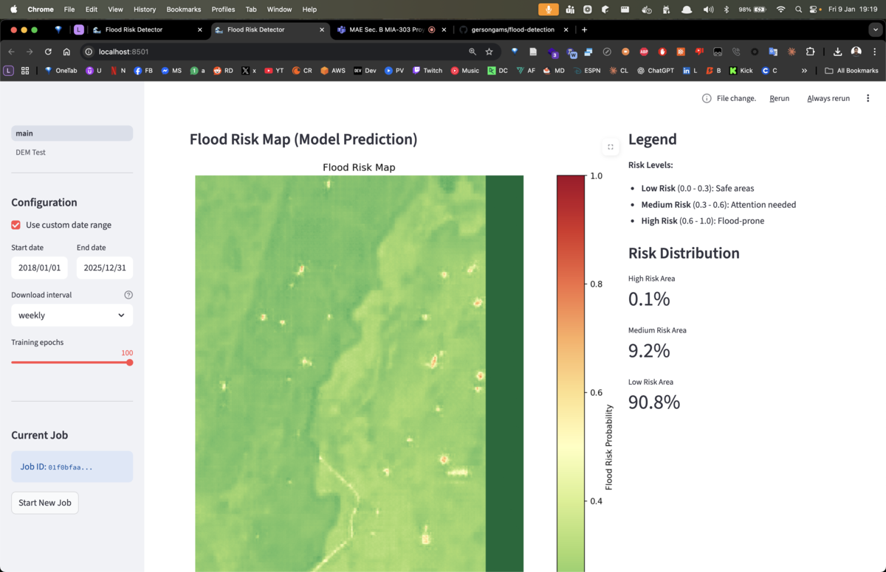
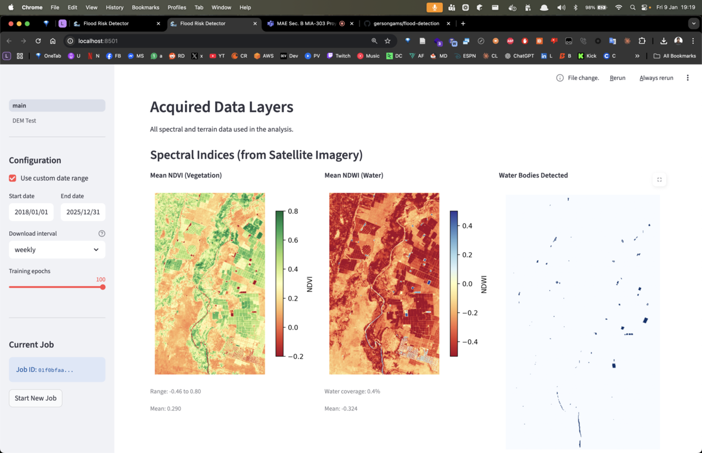
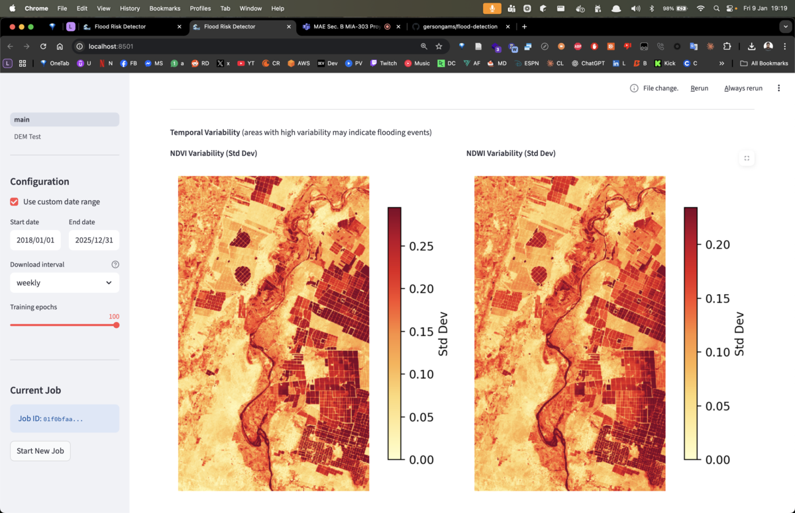
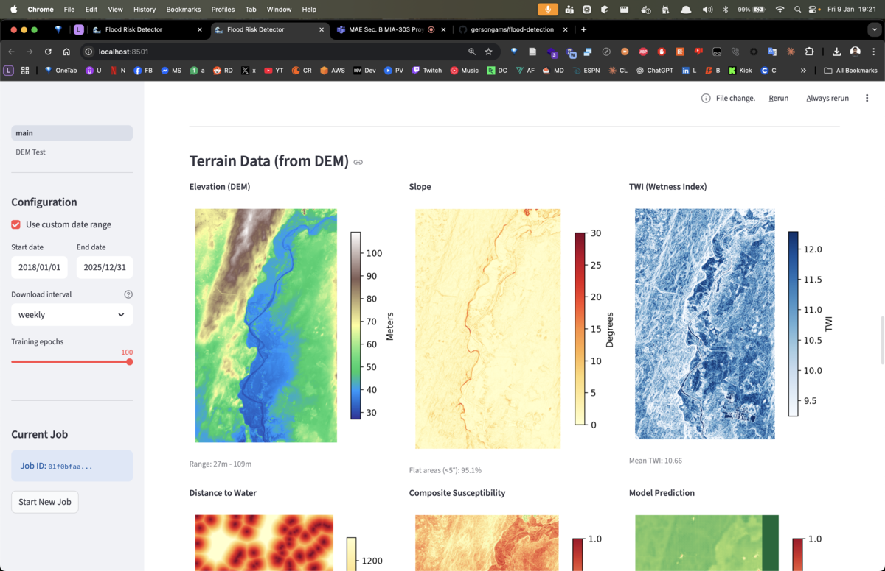
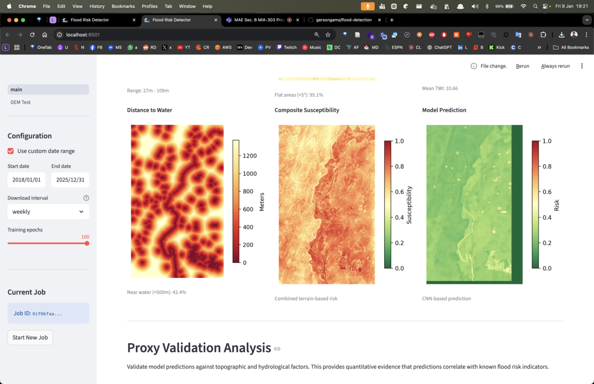
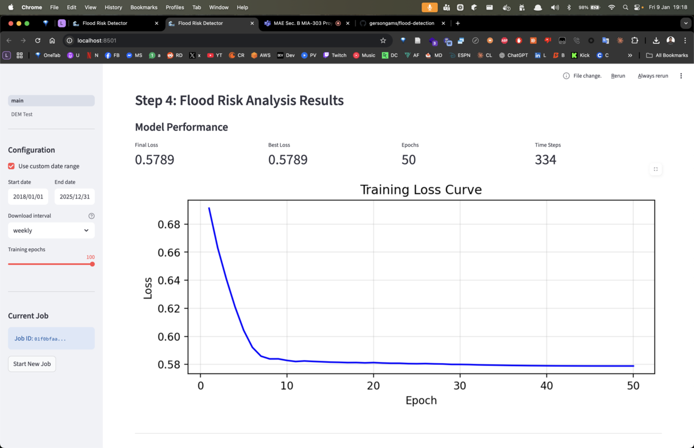
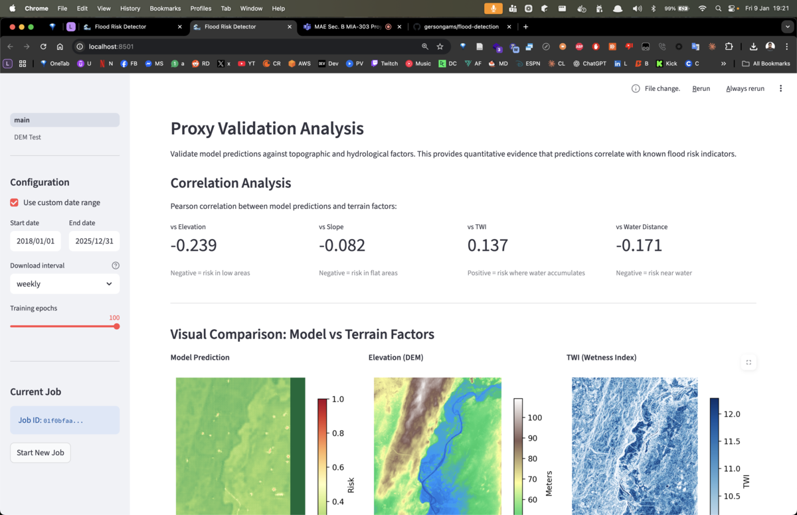
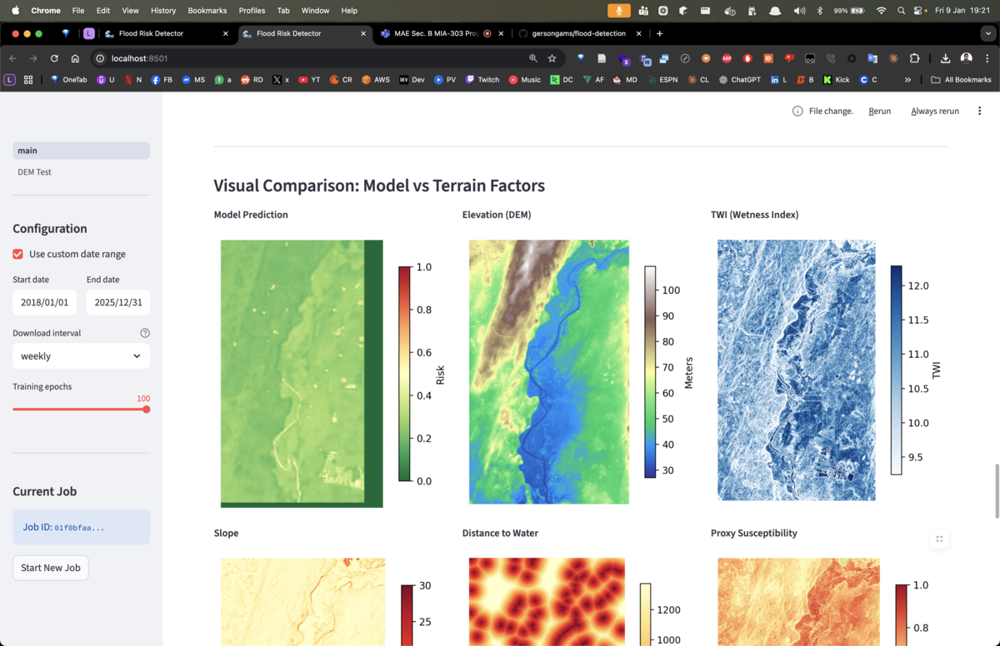
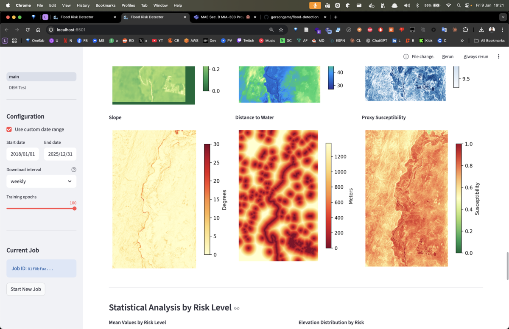
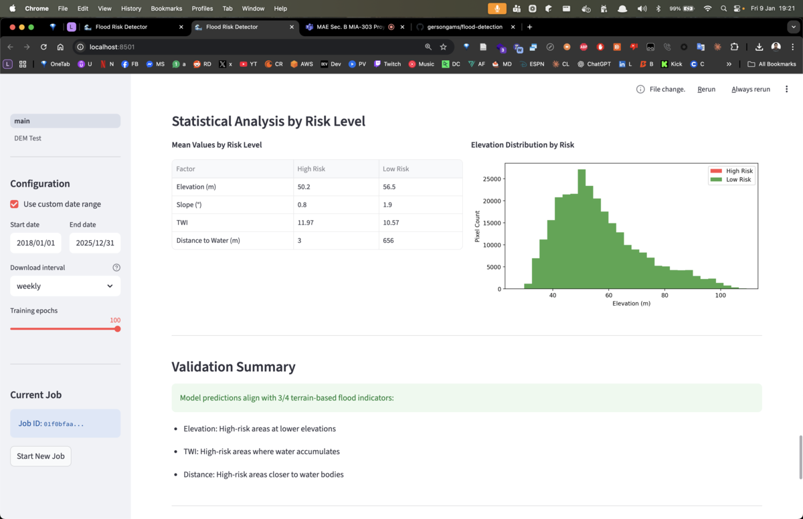

# Detector de Riesgo de Inundaciones

Sistema de análisis de imágenes satelitales para identificar y predecir zonas propensas a inundaciones utilizando técnicas de deep learning.



## Descripción

Este proyecto es parte de una tesis de maestría que utiliza imágenes del satélite Sentinel-2 para detectar áreas con alto riesgo de inundación. El sistema combina:

- **Índices espectrales** (NDVI, NDWI) para detectar vegetación y cuerpos de agua
- **Datos de elevación** (DEM) para análisis topográfico
- **Redes neuronales convolucionales** (CNN) para predicción de riesgo

## Características

### 1. Descarga de Imágenes Satelitales
Descarga automática de imágenes Sentinel-2 desde Sentinel Hub con:
- Intervalos diarios, semanales o mensuales
- Filtro de cobertura de nubes
- Sistema de caché para evitar descargas duplicadas

### 2. Índices Espectrales


- **NDVI** (Índice de Vegetación de Diferencia Normalizada): Evalúa la salud de la vegetación
- **NDWI** (Índice de Agua de Diferencia Normalizada): Detecta cuerpos de agua

### 3. Variabilidad Temporal


Análisis de cambios en el tiempo - áreas con alta variabilidad pueden indicar zonas de inundación histórica.

### 4. Análisis de Terreno (DEM)


- **Elevación**: Áreas bajas tienen mayor riesgo
- **Pendiente**: Terrenos planos acumulan agua
- **TWI** (Índice Topográfico de Humedad): Indica donde se acumula el agua
- **Distancia al agua**: Proximidad a ríos y cuerpos de agua



### 5. Modelo de Deep Learning


Red neuronal convolucional (CNN) encoder-decoder que aprende patrones de inundación a partir de:
- Series temporales de NDVI y NDWI
- Características del terreno (elevación, pendiente, TWI)

### 6. Validación del Modelo


Correlación entre las predicciones del modelo y factores del terreno conocidos.





### 7. Análisis Estadístico


Comparación de valores medios entre zonas de alto y bajo riesgo para validar que el modelo captura correctamente los indicadores de inundación.

## Requisitos

- Python 3.11+
- Docker (para Redis)
- Cuenta en [Sentinel Hub](https://apps.sentinel-hub.com)

## Instalación

### 1. Clonar el repositorio
```bash
git clone https://github.com/tu-usuario/flood-risk-detector.git
cd flood-risk-detector
```

### 2. Instalar dependencias
```bash
uv sync
```

### 3. Configurar variables de entorno
Crear archivo `.env` basado en `.env.example`:
```bash
cp .env.example .env
```

Editar `.env` con tus credenciales de Sentinel Hub:
```env
SH_CLIENT_ID=tu_client_id
SH_CLIENT_SECRET=tu_client_secret
```

### 4. Iniciar Redis
```bash
docker compose up -d
```

## Uso

### 1. Iniciar el worker de Celery
```bash
uv run celery -A app.celery_app worker -l info
```

### 2. Iniciar la aplicación
```bash
uv run streamlit run app/main.py
```

### 3. Abrir en el navegador
Navegar a `http://localhost:8501`

## Flujo de Trabajo

```
┌─────────────────┐     ┌─────────────────┐     ┌─────────────────┐     ┌─────────────────┐
│  1. Seleccionar │     │  2. Descargar   │     │  3. Entrenar    │     │  4. Ver         │
│     Área        │ ──▶ │     Imágenes    │ ──▶ │     Modelo      │ ──▶ │     Resultados  │
└─────────────────┘     └─────────────────┘     └─────────────────┘     └─────────────────┘
```

1. **Seleccionar Área**: Dibujar un rectángulo en el mapa interactivo
2. **Descargar Imágenes**: El sistema descarga imágenes satelitales del período seleccionado
3. **Entrenar Modelo**: La CNN aprende patrones de inundación de los datos
4. **Ver Resultados**: Mapa de riesgo interactivo con estadísticas

## Estructura del Proyecto

```
.
├── app/
│   ├── main.py              # Aplicación Streamlit
│   ├── celery_app.py        # Configuración de Celery
│   ├── tasks.py             # Tareas de background
│   ├── config.py            # Configuración
│   ├── models/
│   │   └── flood_model.py   # Modelo CNN PyTorch
│   └── utils/
│       └── satellite.py     # Utilidades satelitales
├── data/
│   ├── images/              # Imágenes descargadas
│   └── models/              # Modelos entrenados
├── images/                  # Capturas de pantalla
├── analysis.ipynb           # Notebook de análisis original
├── docker-compose.yml       # Contenedor Redis
├── pyproject.toml           # Dependencias UV
└── .env                     # Variables de entorno
```

## Tecnologías

| Categoría | Tecnología |
|-----------|------------|
| Lenguaje | Python 3.11+ |
| Gestor de paquetes | UV |
| Framework Web | Streamlit |
| Tareas en background | Celery + Redis |
| Datos satelitales | Sentinel Hub API |
| Deep Learning | PyTorch |
| Visualización | Folium, Matplotlib |

## Bandas Sentinel-2 Utilizadas

| Banda | Nombre | Uso |
|-------|--------|-----|
| B02 | Azul | Visualización RGB |
| B03 | Verde | NDWI, Visualización RGB |
| B04 | Rojo | NDVI, Visualización RGB |
| B08 | Infrarrojo Cercano (NIR) | NDVI, NDWI |

## Fórmulas

### NDVI (Índice de Vegetación)
```
NDVI = (NIR - Rojo) / (NIR + Rojo) = (B08 - B04) / (B08 + B04)
```
- Valores altos (→1): Vegetación densa y saludable
- Valores bajos (→0): Suelo desnudo, agua, o vegetación muerta

### NDWI (Índice de Agua)
```
NDWI = (Verde - NIR) / (Verde + NIR) = (B03 - B08) / (B03 + B08)
```
- Valores altos (>0.3): Presencia de agua
- Valores bajos (<0): Vegetación o suelo